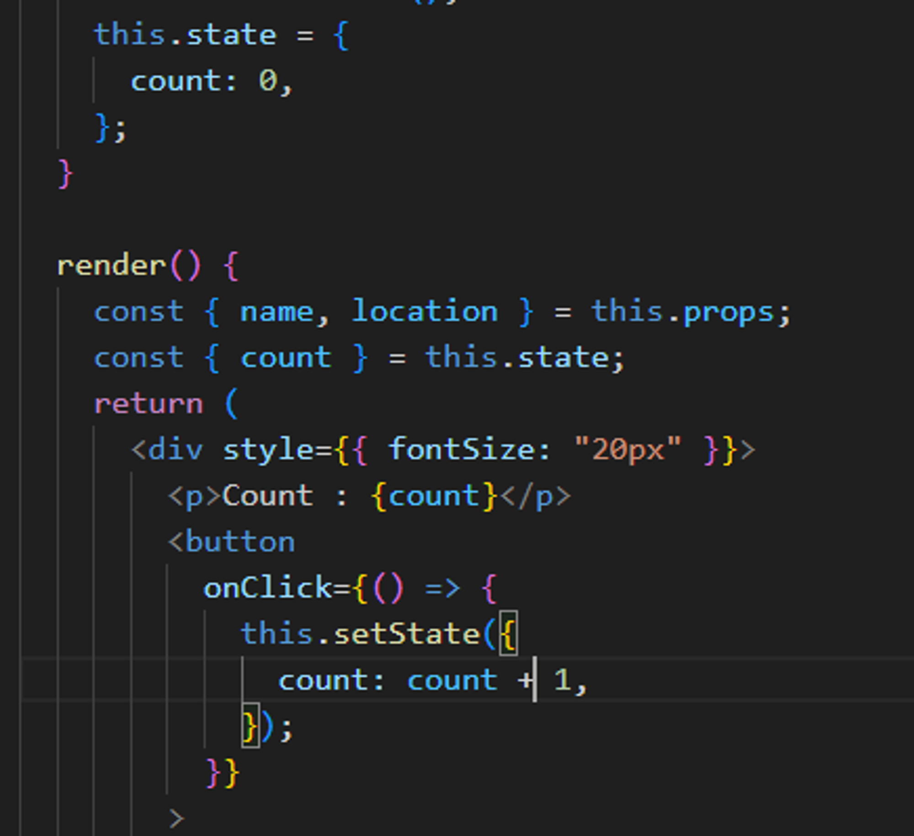
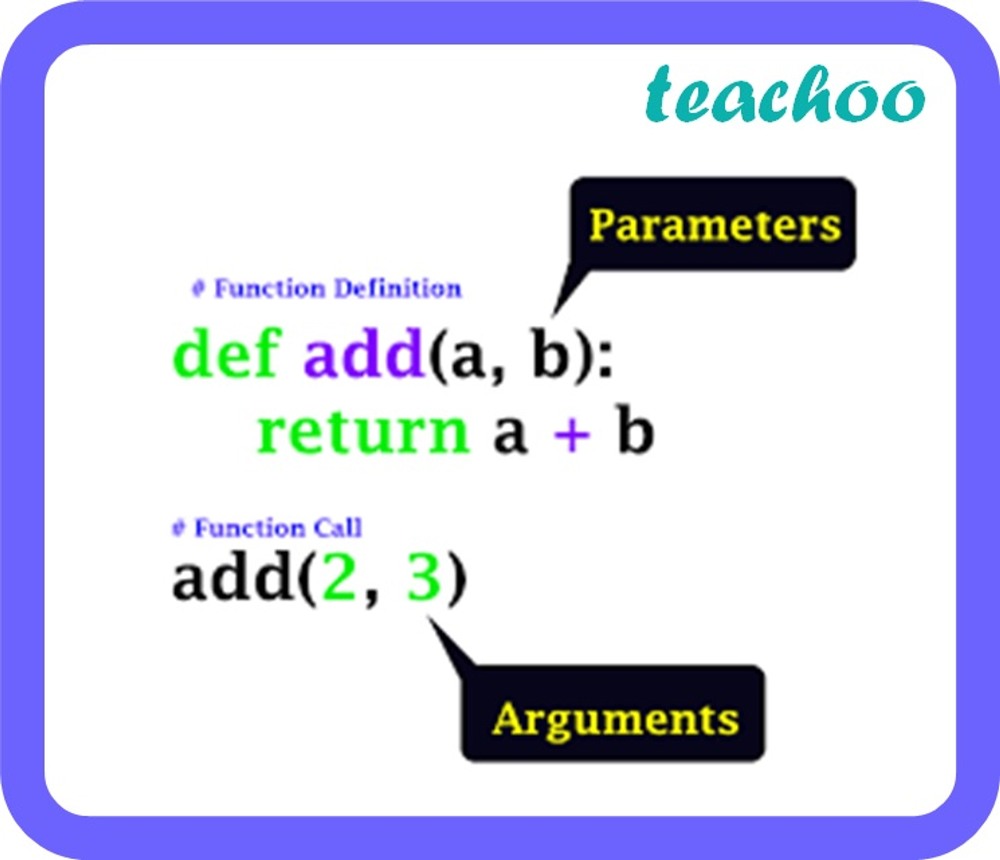
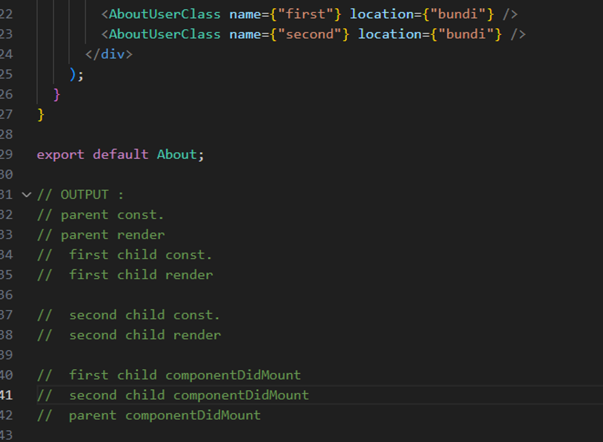
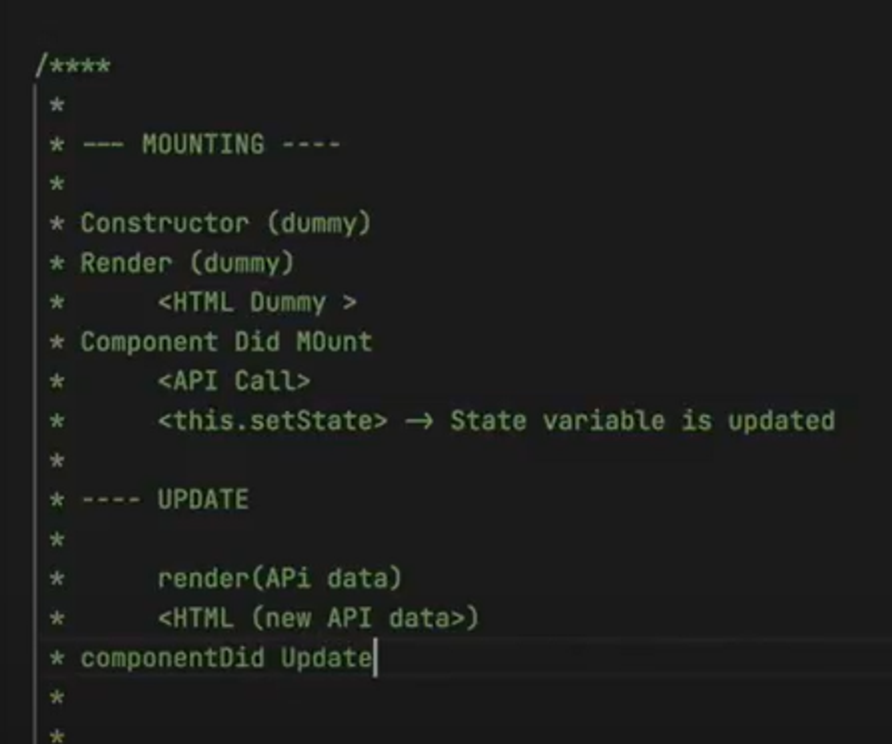
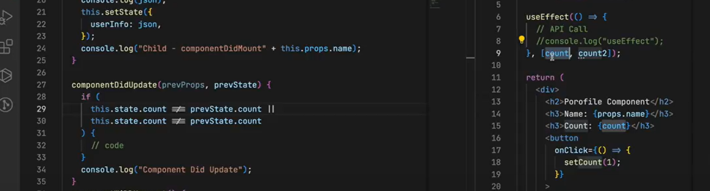

# EP-8 : Let’s get Classy :

**Initialization**: The constructor is the perfect place to initialize the component's state because it runs before the component is mounted. This ensures that the initial state is set up before the component's lifecycle methods are called.

---



the things which you will pass in this.setState, only those gets updated in this.setState. Other remains same.

---

This is also a way to extend :

import {Component } from ‘react’

class About extends Component {}

---

**Q.** Why we use super(props) in constructor ?

**Ans :** `super(props)` in the constructor to call the constructor of the parent class (`React.Component`).

1. **Initialization of `this`**: Before you can use `this` in a subclass constructor, you must call `super()`. This ensures that the parent class (`React.Component`) is properly initialized and that `this` is correctly set up.
2. **Passing Props to the Parent**: If you want to access `this.props` in the constructor or if you want to pass the props to the parent class, you need to pass `props` to `super(props)`. This makes `this.props` available throughout the component, including in the constructor.

---

componentDidMount() is called to make the API calls

---

https://projects.wojtekmaj.pl/react-lifecycle-methods-diagram/ :


because as 1st diagram DOM manipulation is time consuming so react batched the RENDER phase and COMMIT phase of child.

Render and Commit Phase are in 1st diagram.

### Life cycle till update :

componentWillUnmount called when we go to other component.

for the below you can see : ep-8\src\Components\AboutUserClass2.js.



---

**Use Effect Execution Flow :**

```jsx
import React, { useEffect } from "react";

const Header = () => {
  useEffect(() => {
    console.log("Header useEffect called");
  }, []);

  return <header>Header</header>;
};

const About = () => {
  useEffect(() => {
    console.log("About useEffect called");
  }, []);

  return <div>About</div>;
};

const Footer = () => {
  useEffect(() => {
    console.log("Footer useEffect called");
  }, []);

  return <footer>Footer</footer>;
};

const App = () => {
  return (
    <div>
      <Header />
      <About />
      <Footer />
    </div>
  );
};

export default App;
```

### Why `useEffect` Order Matters :

1. **Mounting Order**:
   - React mounts components in the order they are rendered in the JSX.
   - In the example above, `Header` is rendered first, then `About`, and then `Footer`.
2. **Effect Execution Order**:
   - During the initial mount, `useEffect` hooks are called in the order the components are rendered.
   - This means the `useEffect` in `Header` is called first, followed by `useEffect` in `About`, and finally the `useEffect` in `Footer`.

### Conclusion :

The `useEffect` hooks are called in the order that React mounts the components. Therefore, if `Header` is rendered before `About` in your component tree, its `useEffect` will be executed first.

---



in useEffect we pass array but in class based comp. we have to do like this.. so painfull.

**componentDidMount == useEffect with empty array,**

**componentDidUpdate with if-else == useEffect with dependency array.**

**componentWillUnmount == return of useEffect**

---

**\*REACT Form handling**:\*

```jsx
function App() {
  const handleForm = (e) => {
    e.preventDefault(); // Prevent the default form submission behavior
    const formData = new FormData(e.target);
    const obj = Object.fromEntries(formData.entries());
    console.log(obj);
  };

  return (
    <form onSubmit={handleForm}>
      <input name="username" type="text" placeholder="Username" />
      <input name="password" type="password" placeholder="Password" />
      <button type="submit">Submit</button>
    </form>
  );
}
```

- **Creating FormData Object**:
  ```jsx
  const formData = new FormData(e.target);
  ```
  `FormData` is a built-in JavaScript object that allows you to easily construct a set of key/value pairs representing form fields and their values. Here, `new FormData(e.target)` creates a `FormData` object from the form element that triggered the event.
- **Converting FormData to an Object**:
  ```jsx
  const obj = Object.fromEntries(formData.entries());
  ```
  `formData.entries()` returns an iterator of all key/value pairs contained in the `FormData` object. `Object.fromEntries()` converts this iterator into a plain JavaScript object. This allows for easier manipulation and logging of form data.

---

### Why `useEffect` Cannot be Async ?

1. **Consistency in Return Value**:
   `useEffect` expects the callback function to either return nothing or a cleanup function. An `async` function returns a promise, which would break this expectation.
2. **React Lifecycle**:
   Making `useEffect` `async` would make it harder for React to control the component lifecycle and cleanup effects, leading to potential memory leaks or unexpected behavior.
