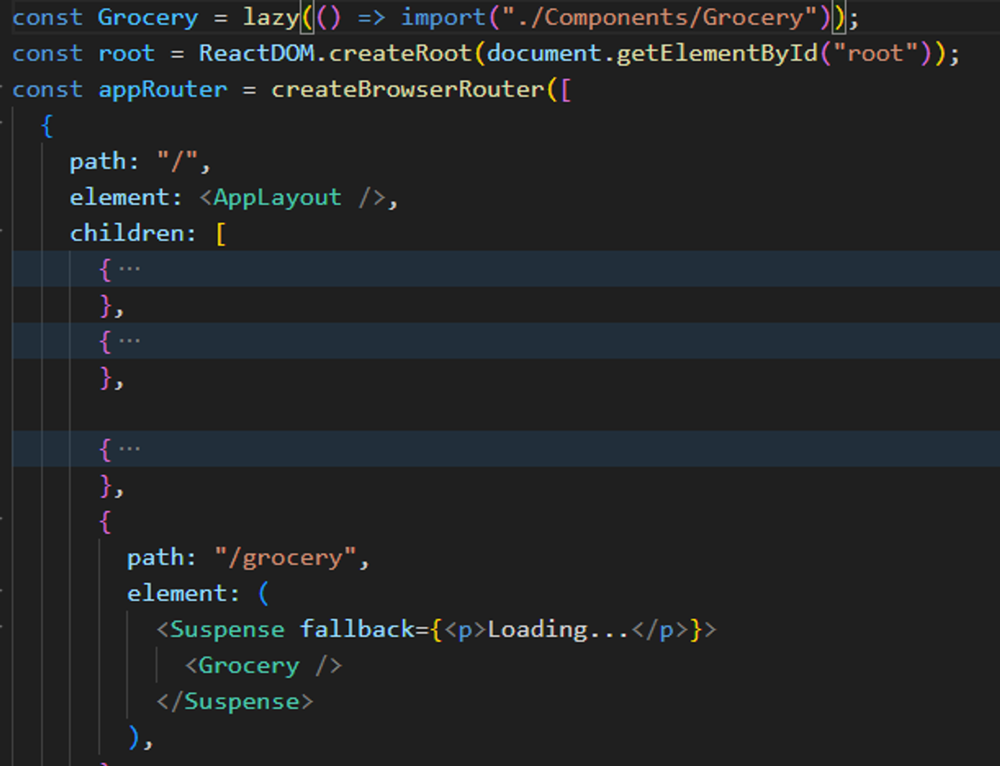
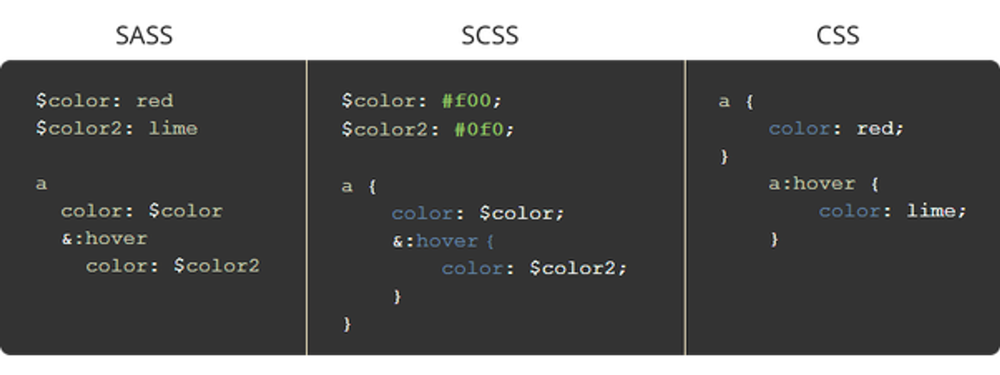

# EP-5 Let’s Get Hooked:-

- What are Hooks ⇒ A normal JS utility function.
- React keep data layer in sync with UI layer
- **Whenever a state variable gets update, react re-renders the component.**
- the setMethod in useState triggers the diff algo and then virtual DOM updates then UI
- Why React is fast ⇒ it do efficient DOM manipulation via virtual DOM
- Read More about react conciliation, react fiber

---

There is no proper folder stru. provided by react but some are recommended :

### Grouping by features or routes



### Grouping by file type



---

Component extension can be .js or .jsx : it doesn’t matter.
`import MyComponent1, {MyComponent2} from "./MyComponent";`

we can use : from “./MyComponent” **OR** from “./MyComponent.jsx” both works
here MyComponent1 is default export and MyComponent2 is normal.

````jsx
import MyComponent1 as MyComponentOne from "./MyComponent";```
````

Named Export : When we put export before the name.
`export const MyComponent2 = () => {}`

**OR**
`const MyComponent2 = () => {
.
.
}
export {MyComponent2}`

---

**Array Destructuring :**

const [first, second] = numbers;

console.log(first); // Output: 1
console.log(second); // Output: 2

const x = [1, 2, 3, 4, 5];

// Destructor the first and third elements
const [a, , b] = x;

console.log(a); // Output: 1
console.log(b); // Output: 3

---

Reconciliation == react fiber.

Reconciliation = whenever something changes on UI it is called reconciliation.

From react 16 new algo came = React fiber to update the DOM.

When you have UI, react creates virtual DOM.

Virtual DOM = Representation of a actual DOM.

Virtual DOM = just an object , (React Element).

Diff algo = finds the diff. between old and new virtual DOM. Calculates the diff. and updates the real DOM.
